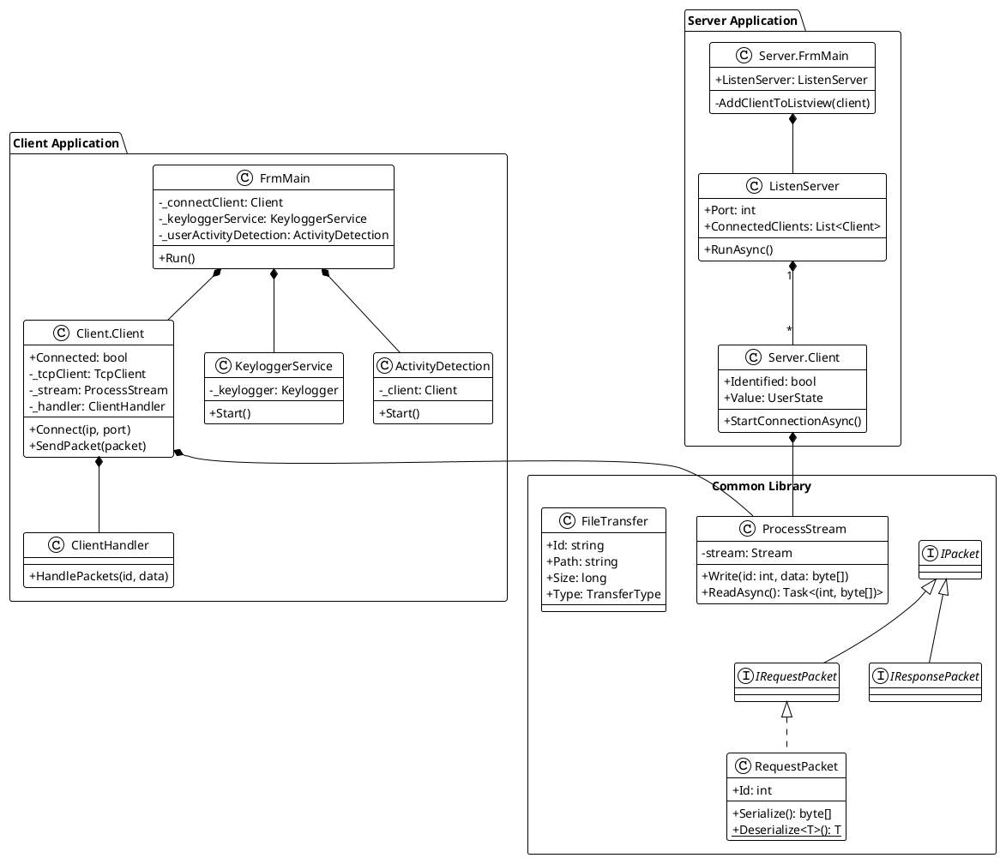
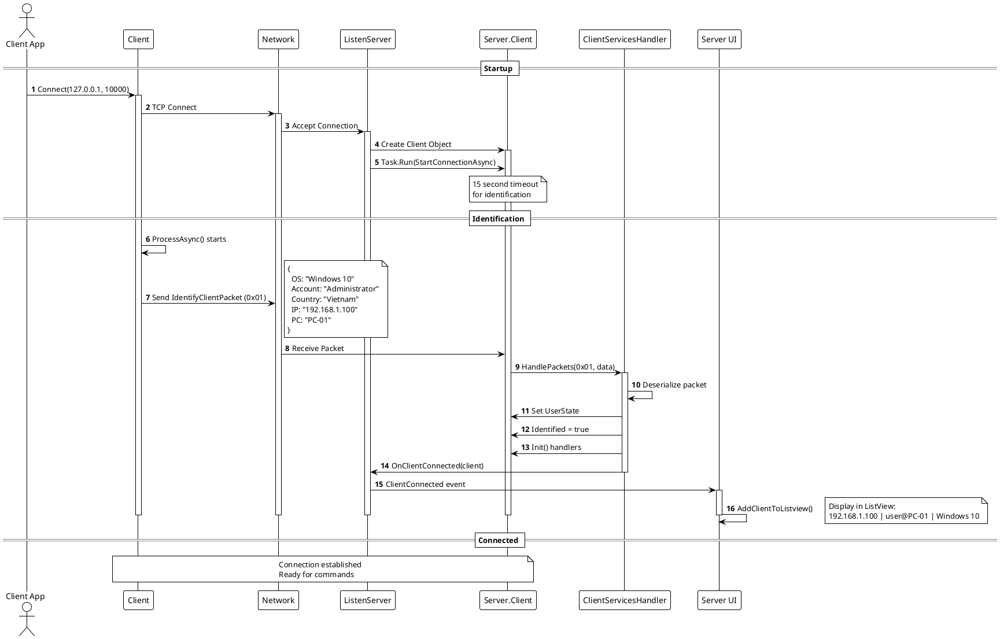
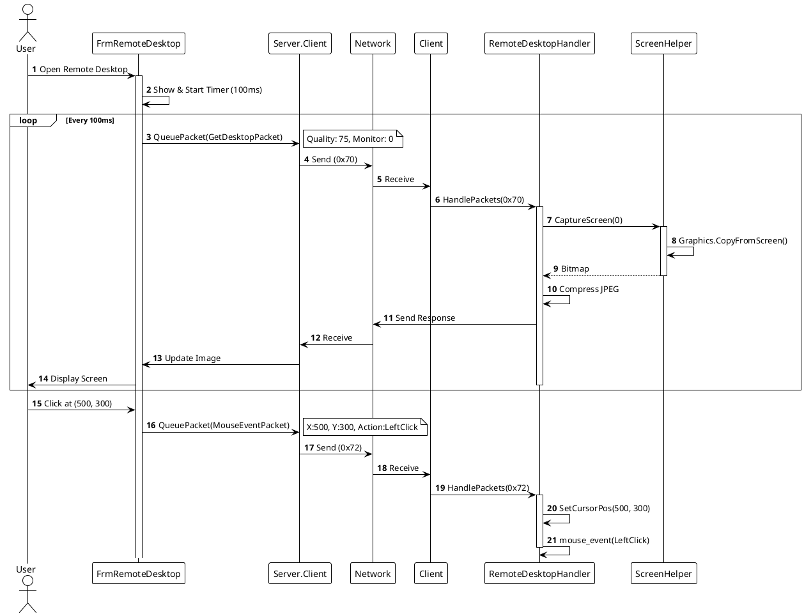
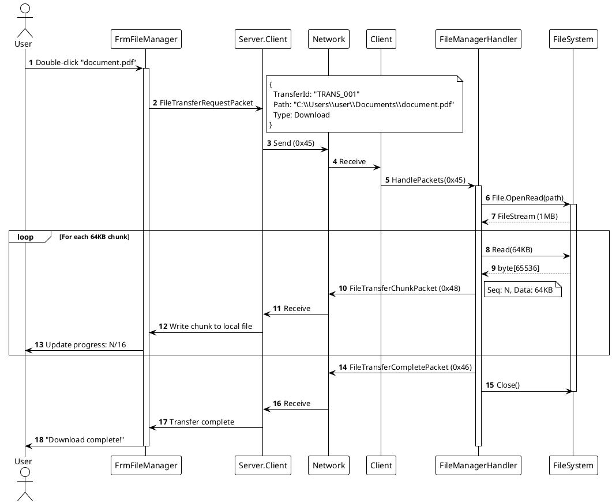
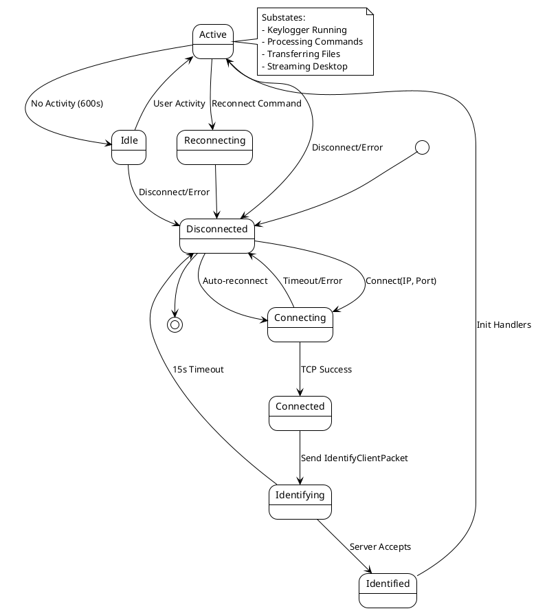
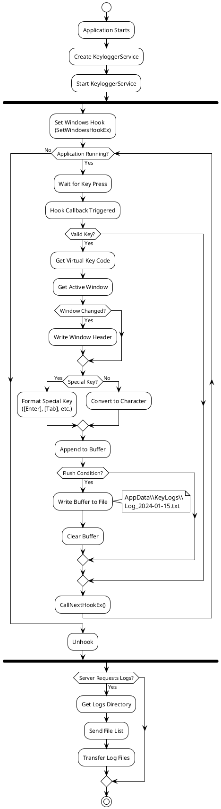

# UML Diagrams - PBL4 Botnet Keylogger

> **Lưu ý**: File này chứa các biểu đồ UML được viết bằng PlantUML. Để render các diagram, sử dụng:
> - **Online**: http://www.plantuml.com/plantuml/uml/
> - **VS Code**: Extension "PlantUML" 
> - **Command line**: `java -jar plantuml.jar file.puml`

## Mục Lục
1. [Class Diagram - Tổng Quan Hệ Thống](#1-class-diagram-tổng-quan-hệ-thống)
2. [Sequence Diagram - Connection Establishment](#2-sequence-diagram-connection-establishment)
3. [Sequence Diagram - Remote Desktop](#3-sequence-diagram-remote-desktop)
4. [Sequence Diagram - File Transfer](#4-sequence-diagram-file-transfer)
5. [Component Diagram](#5-component-diagram)
6. [State Diagram - Client Connection Lifecycle](#6-state-diagram-client-connection-lifecycle)
7. [Activity Diagram - Keylogger Flow](#7-activity-diagram-keylogger-flow)
8. [Deployment Diagram](#8-deployment-diagram)

---

## 1. Class Diagram - Tổng Quan Hệ Thống

### Mô tả
Biểu đồ lớp này thể hiện cấu trúc tổng quan của hệ thống, bao gồm:
- **Common Library**: Thư viện dùng chung cho cả Client và Server
- **Client Application**: Ứng dụng chạy trên máy tính mục tiêu
- **Server Application**: Ứng dụng điều khiển

### PlantUML Code



---

## 2. Sequence Diagram - Connection Establishment

### Mô tả
Biểu đồ tuần tự này mô tả quá trình kết nối và xác thực giữa Client và Server:
1. Client khởi động và kết nối tới Server
2. Server chấp nhận kết nối
3. Client gửi thông tin định danh (IdentifyClientPacket)
4. Server xác thực và thêm client vào danh sách

### PlantUML Code



---

## 3. Sequence Diagram - Remote Desktop

### Mô tả
Biểu đồ này hiển thị luồng hoạt động của tính năng Remote Desktop:
- Server yêu cầu screenshot định kỳ (mỗi 100ms)
- Client capture màn hình, nén JPEG và gửi về
- Server hiển thị hình ảnh
- User có thể điều khiển chuột/bàn phím

### PlantUML Code



---

## 4. Sequence Diagram - File Transfer

### Mô tả
Biểu đồ mô tả quá trình download file từ Client về Server:
- Server gửi yêu cầu transfer
- Client đọc file và chia thành chunks (64KB mỗi chunk)
- Mỗi chunk được gửi tuần tự
- Server nhận và ghi vào file local

### PlantUML Code



---

## 5. Component Diagram

### Mô tả
Biểu đồ thành phần thể hiện các module chính và mối quan hệ giữa chúng.

### PlantUML Code

```plantuml
@startuml Components
!theme plain

package "Client Machine" {
    component "Client App" as ClientApp {
        [FrmMain]
        [Client Networking]
        [Keylogger Service]
        [Activity Detection]
        [Packet Handlers]
    }
    
    component "Windows OS" {
        [Keyboard Hooks]
        [Process API]
        [File System]
        [Screen Capture]
    }
}

package "Network" {
    [TCP/IP] as Network
}

package "Server Machine" {
    component "Server App" as ServerApp {
        [Server.FrmMain]
        [ListenServer]
        [Client Manager]
        [Feature Forms]
        [Packet Handlers]
    }
}

component "Common Library" {
    [ProcessStream]
    [Packet System]
    [Models]
}

ClientApp --> Common: uses
ServerApp --> Common: uses

[Client Networking] --> Network: TCP Socket
Network --> [ListenServer]: TCP Socket

[Keylogger Service] --> [Keyboard Hooks]
[Activity Detection] --> [Keyboard Hooks]
[Packet Handlers] --> [Process API]
[Packet Handlers] --> [File System]
[Packet Handlers] --> [Screen Capture]

@enduml
```

---

## 6. State Diagram - Client Connection Lifecycle

### Mô tả
Biểu đồ trạng thái mô tả vòng đời kết nối của Client.

### PlantUML Code



---

## 7. Activity Diagram - Keylogger Flow

### Mô tả
Biểu đồ hoạt động mô tả quy trình hoạt động của Keylogger.

### PlantUML Code



---

## 8. Deployment Diagram

### Mô tả
Biểu đồ triển khai hiển thị cách các thành phần được deploy trên các node vật lý.

### PlantUML Code

```plantuml
@startuml Deployment
!theme plain

node "Target Machine (Client)" {
    artifact "Client.exe" {
        component "Client Application"
        component "Keylogger Service"
        component "Activity Monitor"
    }
    
    database "Log Files" {
        file "Log_2024-01-15.txt"
        file "Log_2024-01-16.txt"
    }
    
    [Client Application] --> [Log Files]: writes
}

cloud "Network" {
    protocol "TCP/IP\nPort 10000"
}

node "Control Machine (Server)" {
    artifact "Server.exe" {
        component "Server Application"
        component "ListenServer"
        component "Feature Forms"
    }
    
    database "Downloads" {
        folder "Client_192.168.1.100"
    }
    
    [Server Application] --> [Downloads]: writes
}

[Client.exe] ..> [TCP/IP\nPort 10000]: Socket
[TCP/IP\nPort 10000] ..> [Server.exe]: Socket

note right of "Client.exe"
    Deployment:
    - AppData location
    - Runs hidden
    - Auto-start
    - Single instance
end note

note left of "Server.exe"
    Requirements:
    - Admin rights
    - Port forwarding
    - .NET Runtime
end note

@enduml
```

---

## Hướng Dẫn Sử Dụng

### Render PlantUML Diagrams

#### 1. Online (Nhanh nhất)
```
1. Truy cập: http://www.plantuml.com/plantuml/uml/
2. Copy code PlantUML từ file này
3. Paste vào editor
4. Click "Submit" để xem diagram
5. Download as PNG/SVG
```

#### 2. Visual Studio Code
```
1. Install extension: "PlantUML" by jebbs
2. Open file .puml
3. Press Alt+D để preview
4. Right-click → Export để save image
```

#### 3. Command Line
```bash
# Download PlantUML
wget http://sourceforge.net/projects/plantuml/files/plantuml.jar/download -O plantuml.jar

# Render diagram
java -jar plantuml.jar diagram.puml

# Render as SVG
java -jar plantuml.jar -tsvg diagram.puml
```

### Tích Hợp Với GitHub

Để hiển thị diagram trực tiếp trên GitHub README:

```markdown

```

### Giải Thích Các Ký Hiệu

#### Class Diagram
- `+` : Public
- `-` : Private
- `#` : Protected
- `~` : Package
- `{static}` : Static member
- `{abstract}` : Abstract member

#### Relationships
- `-->` : Association
- `..>` : Dependency
- `--|>` : Inheritance
- `..|>` : Realization
- `*--` : Composition
- `o--` : Aggregation

#### Sequence Diagram
- `->` : Synchronous message
- `->>` : Asynchronous message
- `-->` : Return message
- `activate`/`deactivate` : Lifeline
- `note` : Comment/explanation

---

## Tổng Kết

File này cung cấp các UML diagrams chính cho hệ thống PBL4 Botnet Keylogger:

1. **Class Diagram**: Cấu trúc classes và relationships
2. **Sequence Diagrams**: Luồng tương tác cho các chức năng chính
3. **Component Diagram**: Kiến trúc module
4. **State Diagram**: Vòng đời kết nối
5. **Activity Diagram**: Flow của Keylogger
6. **Deployment Diagram**: Triển khai vật lý

Sử dụng kết hợp với file `ARCHITECTURE.md` để có cái nhìn toàn diện về hệ thống.
